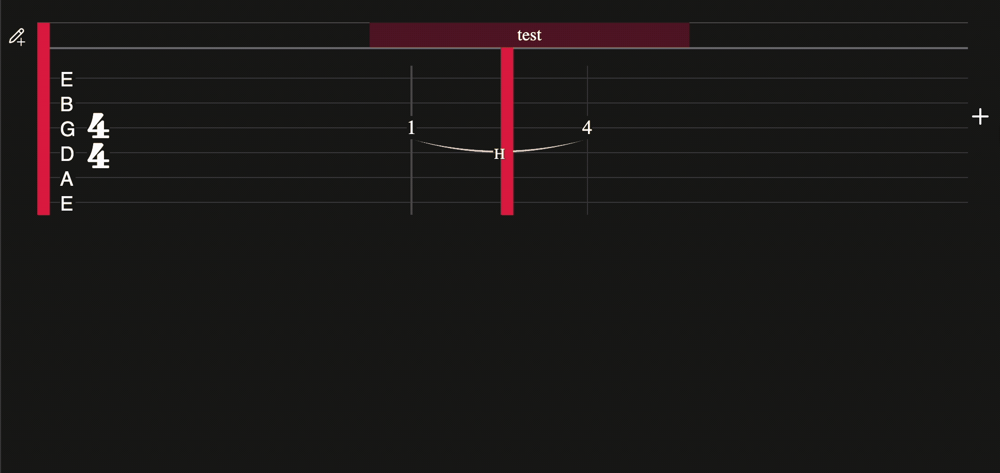

Songshed is a proof-of-concept for a grid-based guitar tabs editor.

Guitar tab editors are either inprecise (they won't let you specify exactly when a note should be hit) or cumbersome (they require classical notation knowledge or have a difficult UI to learn). Songshed divides a bar into a grid, letting you place notes as easily as filling a cell in a table. Then, use drag-and-drop interactions to create ties, bends, and annotations and to move notes and reorder bars.

## Implemented Features

- Ties (hammer/pull-off, slur, slide)
- Bends (prebends, holds, release)
- Select notes by dragging
  - Delete selected notes
  - Move selected notes by dragging
  - Copy and paste selected notes
- Add and delete bars
- Drag to move new bars
- Break the bars into new lines
- Text annotations
  - drag to create
  - drag handles to resize
  - delete text to delete annotation, add new annotation rows)
- Time changes
- Change tuning (quickly change the note, or expand for note + octave)
- Interactive GUI for chord diagrams - edit, reorder, rename
  - Chord name detection with [tonaljs](https://github.com/tonaljs/tonal)
  - Chord picker using [chords-db](https://github.com/tombatossals/chords-db)
- Serializing/deserializing tabs (basic save and load)
- Dark and light mode (currently works based off of your system preference)

## Planned Features

- Triplets
- Integration with [alphaTab](https://alphatab.net/) for playback, PDF generation, export to Guitar Pro
- Dragging chords to the bar for chord rhythm notation
- Full account and profile system (save, view tabs, share)
- Mobile version
- Copy chords and bars as images
- Multiple tab views (i.e., multiple guitar/bass parts for the same song)

## Responsiveness

The app is fully responsive, breaking bars across lines and automatically shrinking empty columns to make more space:

If a tie, bend, or annotation expands across a bar, and those bars end up on separate lines, they will gracefully break:

_this README under development!_
